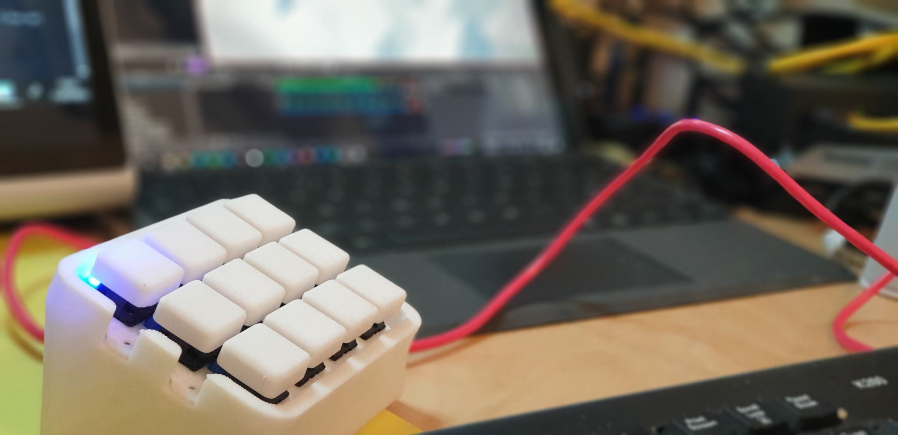
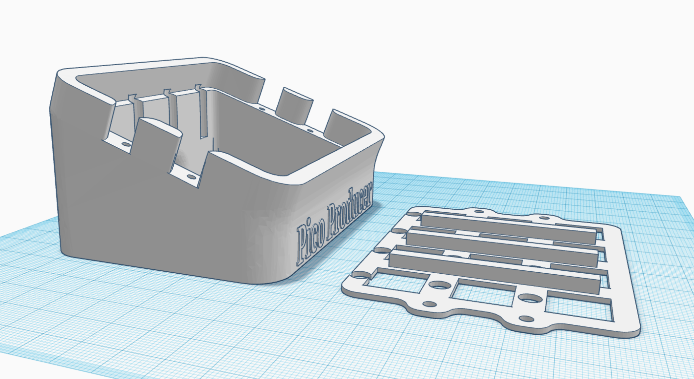
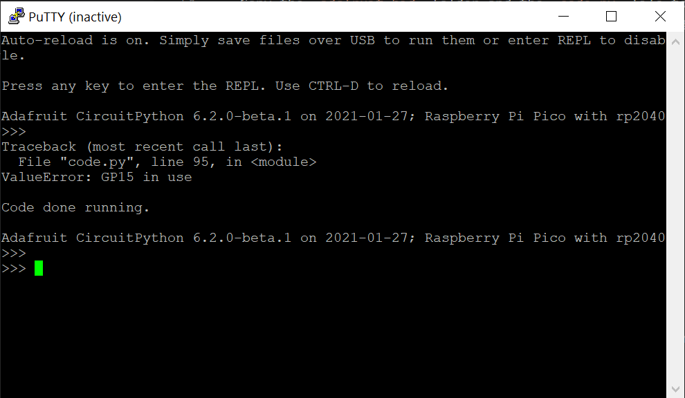

# Pico Producer

## About this Project

This project is an OBS Controller using a Raspberry Pi Pico and CircuitPython.



# In Action


## Basic Circuit


I've avoid GP15 as it's assigned a USB function... Using GP15 results in the following error at startup;

"ValueError: GP15 in use"

# Case

We now have two different case designs....

Cliff Agius and his son have created a version of the box suited for buttons with holes for LEDs.

I've modified this design to add LEDs above each button;



It was originally based on this design;

https://www.thingiverse.com/thing:4186055

The keycaps are from here;

https://www.thingiverse.com/thing:4186055

# CircuitPython HID

You can find some more info about the CircuitPython KeyMappings here;

https://circuitpython.readthedocs.io/projects/hid/en/latest/_modules/adafruit_hid/keycode.html

## Instructions

- Plug in the Raspberry Pi Pico while holding the onboard button.
- Your PC will mount the Pico as a drive
- Copy the `adafruit-circuitpython-raspberry_pi_pico-en_US-6.2.0-beta.1.uf2` file to the Pico
- The Pico will reboot once it's done with CircuitPython onboard.
- Copy the `adafruit_hid` folder and the `code.py` file to the Pico
- In OBS setup Hotkeys for the different scenes by putting your cursor in the Hotkey Box and pressing a button...

```
Scene 1 =  ctrl + KeyPad 1
Scene 2 =  ctrl + KeyPad 2
Scene 3 =  ctrl + KeyPad 3
Scene 4 =  ctrl + KeyPad 4
Scene 5 =  ctrl + KeyPad 5
Scene 6 =  ctrl + KeyPad 6
Scene 7 =  ctrl + KeyPad 7
Scene 8 =  ctrl + KeyPad 8
Scene 9 =  ctrl + KeyPad 9
Scene 10 =  ctrl + KeyPad 0
```

- Press the buttons to change scenes in OBS!
- Each button will light a corresponding LED to show which Scene is currently active.

## Debugging

Circuit Python creates a virtual COM port, so you can use a terminal Program set to 8N1 9600 Baud to debug the code... Just hit the enter key at teh prompt, and the terminal will echo there.

It might help to put a large enough delay at the start of your code to give you time to intiialise the terminal.



## Future Planning

- Look at Bluetooth / WebSockets (Will need add on circuitary!)

## Notes

the HID control code is based on a nice blog post by Hriday which shows how to get the Pico working as a HID device, emulating a keyboard;

https://hridaybarot.home.blog/2021/01/31/using-raspberry-pi-pico-has-hid-device-to-control-mouse-and-keyboard/