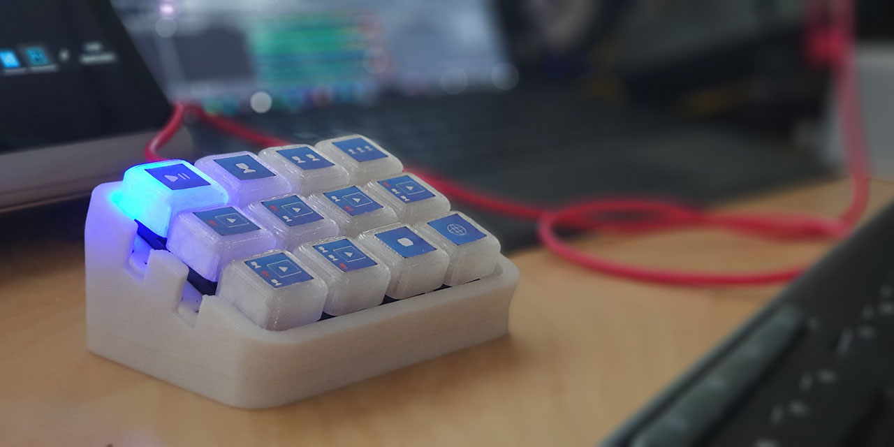
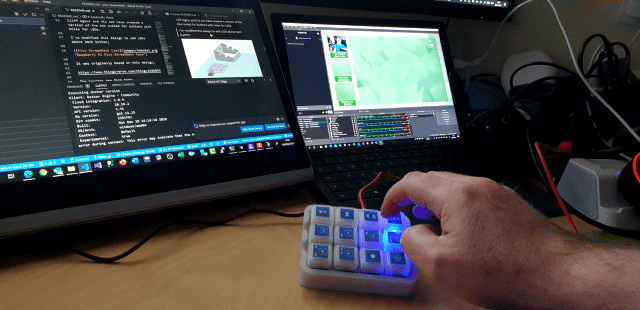
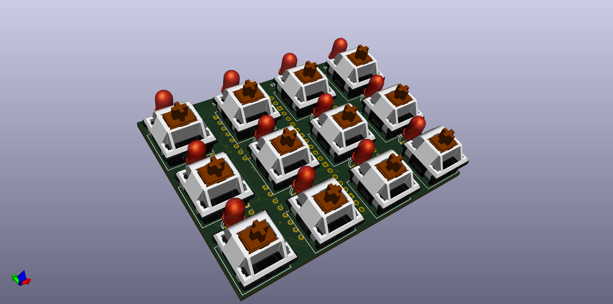
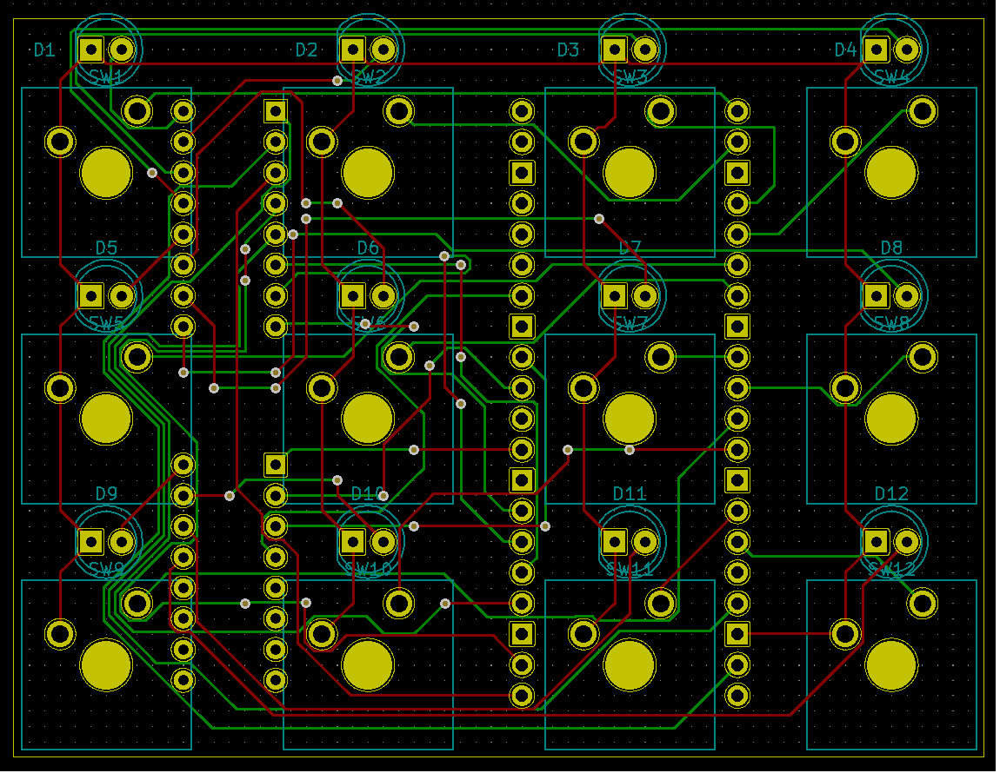

# Pico Producer

## About this Project

This project is an OBS Controller using a Raspberry Pi Pico and CircuitPython.



# In Action



## Basic Circuit


I've avoid GP15 as it's assigned a USB function... Using GP15 results in the following error at startup;

"ValueError: GP15 in use"

# PCB

Front



Back


PCB



# Parts List


| Part | Qty | Link |
|------|-----|------|
| Cherry MX Keycaps | 12 | https://amzn.to/2Oo1nLP |
| 3mm LED | 12 | https://amzn.to/3rAqNEV |
| 220 Ohm 8x Isolated Resistor Pack | 2 | http://bit.ly/picoproducerresistorarray |
| Raspberry Pi Pico | 1 | http://bit.ly/pimoroni-pico |
| 20 pin Male PCB Header | 2 | https://amzn.to/3sUr8lN |

Notes: 

- You can feel free to use 12 individual 220 Ohm Resistors - https://amzn.to/3qqaWai
- If you wire this without a PCB then use the following wire from Pimoroni - http://bit.ly/pimoroni-rainbow-wire

# Case

We now have two different case designs....

Cliff Agius and his son have created a version of the box suited for buttons with holes for LEDs.

I've modified this design to add LEDs above each button;


It was originally based on this design;

https://www.thingiverse.com/thing:4186055

The keycaps are from here;

https://www.thingiverse.com/thing:4186055

# Assembly Hints

- Insert the 20 Pin PCB headers with the long legs away from the PCB towards the Pico (Otherwise it'll fowl the faceplate)
- Solder the 2 Resistor Packs and the Pico PCB Headers first. Then the LEDs and Buttons. Then the Pico.
- You'll need to trim the legs on the resistor packs which border the three left hand buttons.
- Insert the LEDs into the PCB, then insert the Buttons into the faceplate and then insert that into the PCB.
- Push the leds back through the PCB, so they poke into the holes in the faceplate, otherwise they'll be below the faceplate.
- You'll need to trim the legs on the PCB headers otherwise it'll fowl the bottom of the case.


# CircuitPython HID

You can find some more info about the CircuitPython KeyMappings here;

https://circuitpython.readthedocs.io/projects/hid/en/latest/_modules/adafruit_hid/keycode.html

## Instructions

- Plug in the Raspberry Pi Pico while holding the onboard button.
- Your PC will mount the Pico as a drive
- Copy the `adafruit-circuitpython-raspberry_pi_pico-en_US-6.2.0-beta.1.uf2` file to the Pico
- The Pico will reboot once it's done with CircuitPython onboard.
- Copy the `adafruit_hid` folder and the `code.py` file to the Pico
- In OBS setup Hotkeys for the different scenes by putting your cursor in the Hotkey Box and pressing a button...

```
Scene 1 =  ctrl + F1
Scene 2 =  ctrl + F2
Scene 3 =  ctrl + F3
Scene 4 =  ctrl + F4
Scene 5 =  ctrl + F5
Scene 6 =  ctrl + F6
Scene 7 =  ctrl + F7
Scene 8 =  ctrl + F8
Scene 9 =  ctrl + F9
Scene 10 =  ctrl + F10
Scene 11 =  ctrl + F11
Scene 12 =  ctrl + F12
```

- Press the buttons to change scenes in OBS!
- Each button will light a corresponding LED to show which Scene is currently active.

## Debugging

Circuit Python creates a virtual COM port, so you can use a terminal Program set to 8N1 9600 Baud to debug the code... Just hit the enter key at teh prompt, and the terminal will echo there.

It might help to put a large enough delay at the start of your code to give you time to initialise the terminal.


## Future Planning

- Look at Bluetooth / WebSockets (Will need add on circuitary!)
- Possible Matrix Input (But, I like the simplicity)
- Possible Resistor Ladder Input (But, again, I like the simplicity)

## Notes

The HID control code is based on a nice blog post by Hriday which shows how to get the Pico working as a HID device, emulating a keyboard;

https://hridaybarot.home.blog/2021/01/31/using-raspberry-pi-pico-has-hid-device-to-control-mouse-and-keyboard/

## Thanks

Thanks to Cliff Agius and his son for the original 3d Files.
Thanks to John Furcean for refactoring the code.
Thanks to frankalicious for fixing some spelling checks. 
