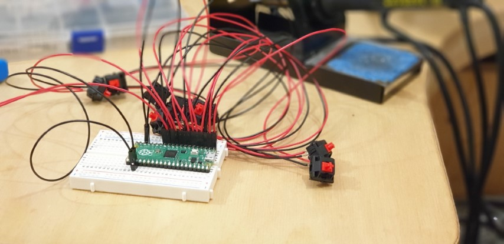

# Raspberry Pi Pico StreamDeck

## About this Project

This is a work in progress progress to create an OBS StreamDeck using a Raspberry Pi and CircuitPython.

Some of this work is based on a nice blog post by Hriday which shows how to get the Pico working as a HID device, emulating a keyboard;

https://hridaybarot.home.blog/2021/01/31/using-raspberry-pi-pico-has-hid-device-to-control-mouse-and-keyboard/

I'll be updating this README very soon to show how it all works...



## Basic Circuit


## Instructions

- Plug in the Raspberry Pi Pico while holding the onboard button.
- Your PC will mount the Pico as a drive
- Copy the `adafruit-circuitpython-raspberry_pi_pico-en_US-6.2.0-beta.1.uf2` file to the Pico
- The Pico will reboot once it's done with CircuitPython onboard.
- Copy the `adafruit_hid` folder and the `code.py` file to the Pico
- In OBS setup Hotkeys for the different scenes

```
Scene 1 =  ctrl + KeyPad 1
Scene 2 =  ctrl + KeyPad 2
Scene 3 =  ctrl + KeyPad 3
Scene 4 =  ctrl + KeyPad 4
```

- Press the buttons which are wired up to GPIOs 0,1,2 and 3 to change scenes in OBS!

## Future Planning

- Add LEDs for each button to show which scene is currently selected.
- 3D print a case and keycaps
- Look at Bluetooth / WebSockets (Will need add on circuitary!)